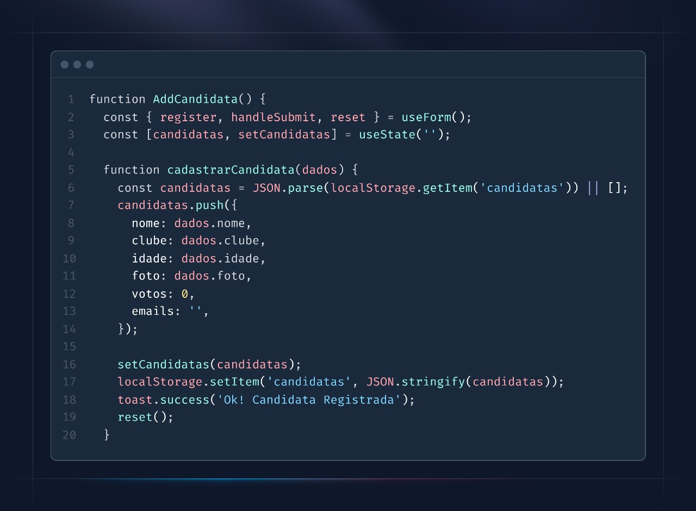
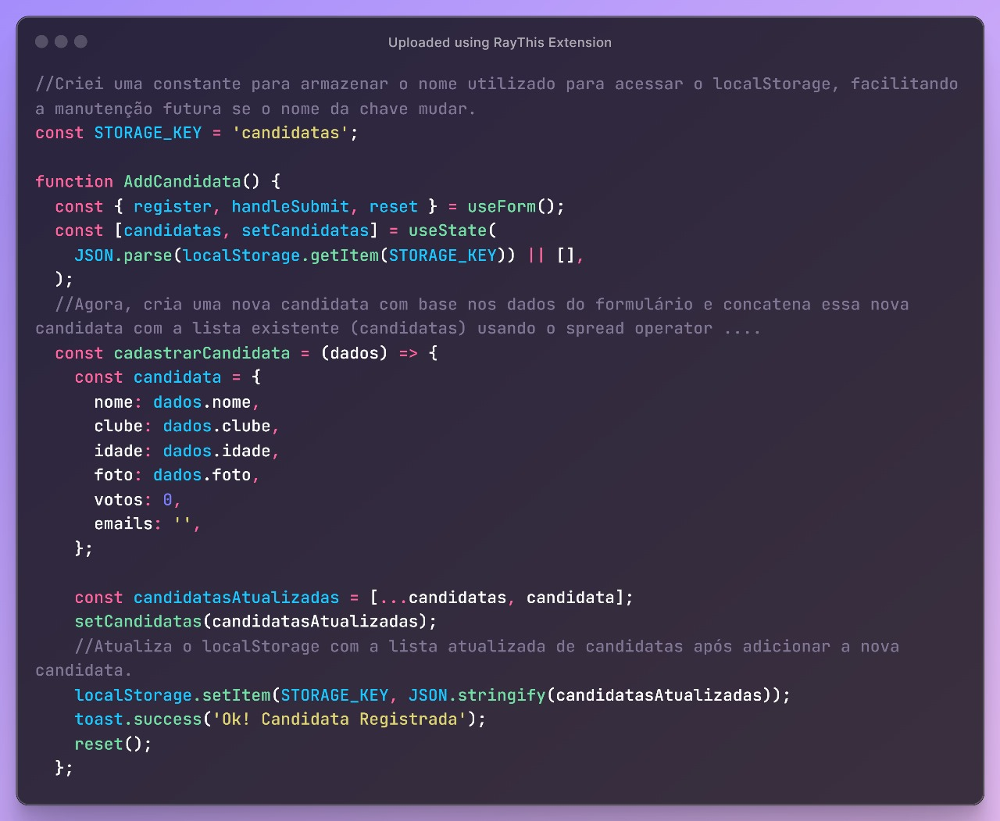
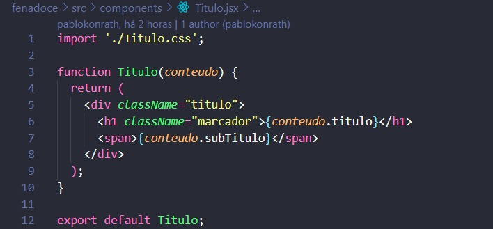
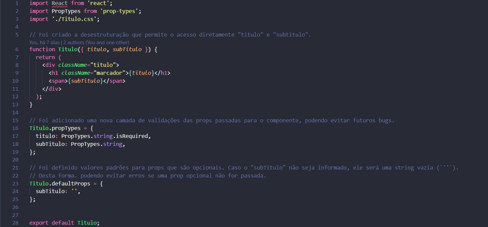
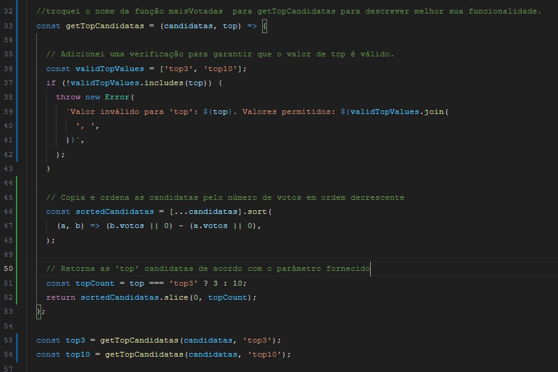

## Descrição do Pull Request

Este pull request contém as implementações dos codigos refatorados dos colaboradores abaixo

### Colaboradores

- Pablo
- Ricardo
- Felipe
- John

### Objetivo

O objetivo deste pull request é integrar as funcionalidades desenvolvidas por cada colaborador na branch principal do projeto, seguindo boas praticas do clean code.

### Implementações

- Pablo: Criou a branch refactor/addcandidata-component
  - Refatorei a função principal AddCandidata.jsx.
  - prints do antes e depois no final do arquivo
  #
- Ricardo: Criou a branch refactor/titulo
  - Refatorou o component Titulo.jsx
  - prints do antes e depois no final do arquivo
  #
- Felipe: Criou a branch refactor/classificacao-component
  - Refatorou o component Titulo.jsx
  - prints do antes e depois no final do arquivo
  #
- John: Criou a branch refactor/card
  - Refatorou a função votar do component card.jsx
  - prints do antes e depois no final do arquivo

### Passos realizados por cada colaborador

1. Criou a branch de desenvolvimento `refactor/xxx` a partir da branch `main`
2. git switch -c refactor/......
3. Feita as alterações necessárias nos arquivos logo em seguida

- git status
- git add .
- git commit -m "refatorado arquivo x"

4. Feito o merge da branch de desenvolvimento na main

- git switch main
- git merge refactor/....

### Checklist

- [x] As alterações foram testada apos o codigo modificado?
- [x] Os testes foram executados localmente?
- [x] Todos os testes passaram?
- [x] Prints do antes e depois

### Prints do antes e depois do codigo refatorado

1º Colaborador Codigo modificado pelo colaborador Pablo

#

#

Antes

Depois

2º Codigo modificado pelo colaborador Ricardo

#

#

Antes

Depois

3º Codigo modificado pelo colaborador Felipe

#

#

Antes

Depois

4º Codigo modificado pelo colaborador John

#

#

Antes

Depois
